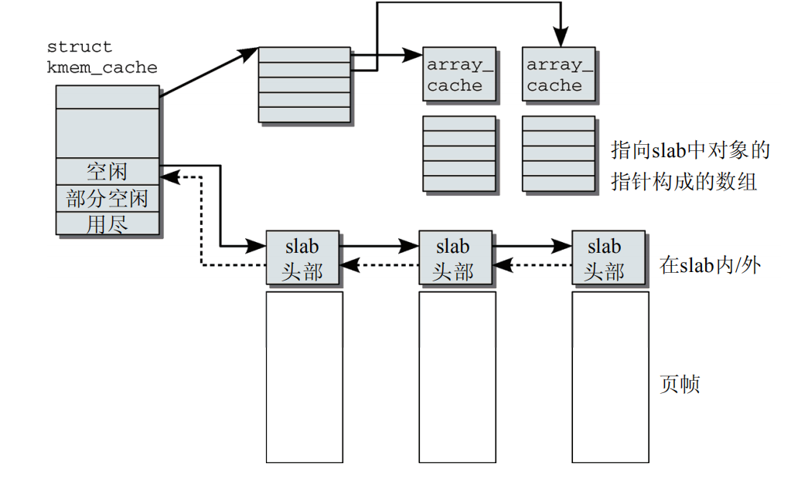

在linux内核中伙伴系统用来管理物理内存，其分配的基本单位是页。由于伙伴系统分配的粒度又太大，因此linux采用slab分配器提供动态内存的管理功能，而且可以作为经常分配并释放的对象的高速缓存。slab分配器的优点：

1. 可以提供小块内存的分配支持，通用高速缓存可分配的大小从$2^5B$到$2^{25}B$，专用高速缓存没有大小限制；

2. 不必每次申请释放都和伙伴系统打交道，提供了分配释放效率；

3. 如果在slab缓存的话，其在CPU高速缓存的概率也会较高；

4. 伙伴系统对系统的数据和指令高速缓存有影响，slab分配器采用着色降低了这种副作用。

伙伴系统分配的内存大小是页的倍数，不利于CPU的高速缓存：如果每次都将数据存放到从伙伴系统分配的页开始的位置会使得高速缓存的有的行被过度使用，而有的行几乎从不被使用**[cpu的L1 cache一般大小为32KB，采用伙伴系统分配$order\geq5$时就会出现上述的问题**]。slab分配器通过着色使得slab对象能够均匀的使用高速缓存，提高高速缓存的利用率。

### 基本数据结构

`struct kmem_cache`、`struct array_cache`、`struct kmem_cache_node`

程序经常需要创建一些数据结构，比如进程描述符task_struct，内存描述符mm_struct等。slab分配器把这些需要分配的小块内存区作为对象，类似面向对象的思想。每一类对象分配一个cache，cache有一个或多个slab组成，slab由一个或多个物理页面组成。需要分配对象的时候从slab中空闲的对象取，用完了再放回slab中，而不是释放给物理页分配器，这样下次用的时候就不用重新初始化了，实现了对象的复用。



### 鸡和蛋问题

由于slab分配器对象（`struct kmem_cache、struct array_cache、struct kmem_cache_node`）也需要用slab分配器提供的高速缓存机制，那么问题是：先有高速缓存还是先有slab分配器对象。

1. 我们知道slab分配器对象用来管理高速缓存：假设先有高速缓存的话，那么谁来管理高速缓存呢？
2. 我们知道高速缓存用来存放slab分配器对象：假设先有slab分配器对象，那么它存放在哪里呢？

linux的做法是：静态分配slab分配器对象内存空间，然后利用伙伴算法分配存储对象的页帧，


static struct kmem_cache kmem_cache_boot

\#define NUM_INIT_LISTS (2 * MAX_NUMNODES)

static struct kmem_cache_node __initdata init_kmem_cache_node[NUM_INIT_LISTS];

struct kmem_cache *

kmalloc_caches[NR_KMALLOC_TYPES][KMALLOC_SHIFT_HIGH + 1]

每种对象类型对应一个高速缓存，kmalloc使用的是通用高速缓存


高速缓存划分为slab，slab有一个或多个物理上连续的页组成（一般是一个页），每个告诉缓存由多个slab


每个slab包含数据结构，


slab状态：满、部分满、空

部分满》空》创建一个slab

### slab着色原理

一般情况下，slab的大小为4KB。我们令cpu的L1 cache为32KB（每一行64B、512行），那么要填充满cpu的L1 cache需要8个slab。那么slab分配器会从伙伴分配系统中分配8个slab，也就是8个页（8个页不一定是物理连续的）。假设获取的8个页对应的的起始地址和终止地址如下：

```c
0x10000000 - 0x10001000：对应cache行是0-64
0x10010000 - 0x10011000：对应cache行是0-64
0x10020000 - 0x10021000：对应cache行是0-64
0x10030000 - 0x10031000：对应cache行是0-64
0x10040000 - 0x10041000：对应cache行是0-64
0x10050000 - 0x10051000：对应cache行是0-64
0x10060000 - 0x10061000：对应cache行是0-64
0x10070000 - 0x10071000：对应cache行是0-64
```

可以发现不同的slab起始地址映射到cpu cache的同一行。slab着色原理是利用浪费的空间，假设浪费的空间所占用的cache行是$[1,10)$。那么slab中对象实际占用的cache行是$0\cup[11,64)$。那么可以通过偏移来让部分的对象移动到$[1,10)$行内。尽管slab着色可以使得对象尽可能占满cache，但是slab的着色仍然有很大的限制：

1. 无法占满剩余的行数，上述实例中$[64,512)$仍然未被使用；
2. 当slab的个数超过颜色数，效果甚微；
3. slab的着色是用空间换时间，浪费一些空间来提高cache的命中率。

