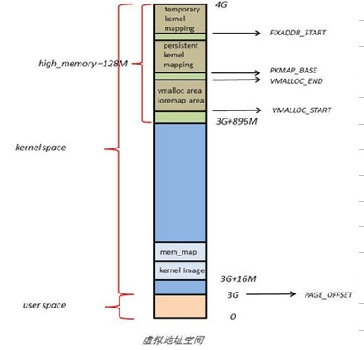

pg_data_t

struct zone

struct free_area

uma 和numa

### 内核分区

1. ZONE_DMA标记适合DMA的内存域。该区域的长度依赖于处理器类型。在IA-32计算机上，一般的限制是16 MiB，这是由古老的ISA设备强加的边界，因此现代的计算机也可能受这一限制的影响。

2. ZONE_DMA32标记了使用32位地址字可寻址、适合DMA的内存域。显然，只有在64位系统上，两种DMA内存域才有差别。在32位计算机上，本内存域是空的，即长度为0 MiB。在Alpha和AMD64系统上，该内存域的长度可能从0到4 GiB。 

3. ZONE_NORMAL标记了可直接映射到内核段的普通内存域。这是在所有体系结构上保证都会存在的唯一内存域，但无法保证该地址范围对应了实际的物理内存。例如，如果AMD64系统有2 GiB内存，那么所有内存都属于ZONE_DMA32范围，而ZONE_NORMAL则为空。

4. ZONE_HIGHMEM标记了超出内核段的物理内存。

